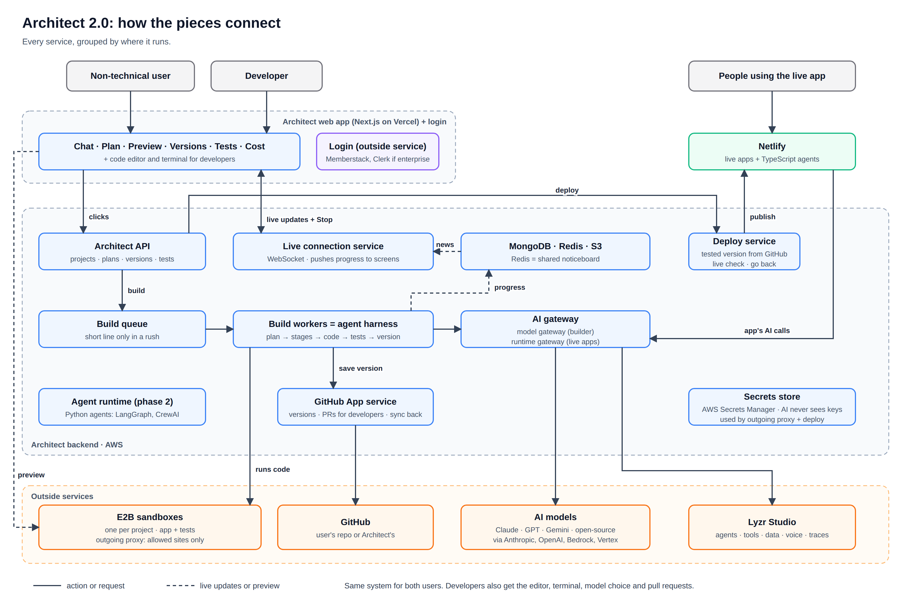
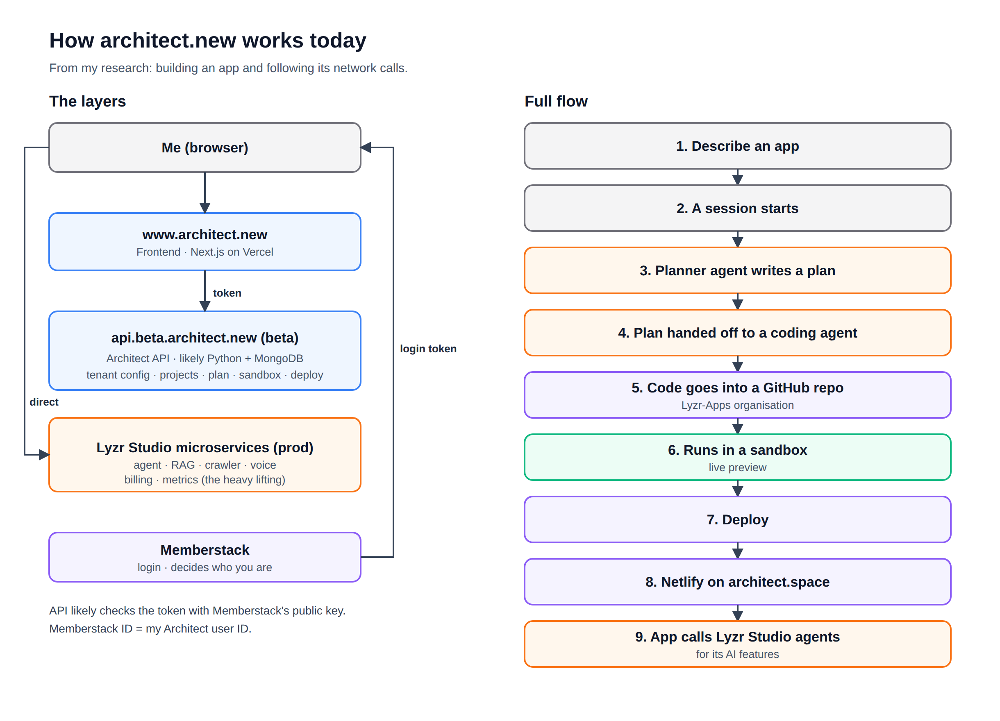
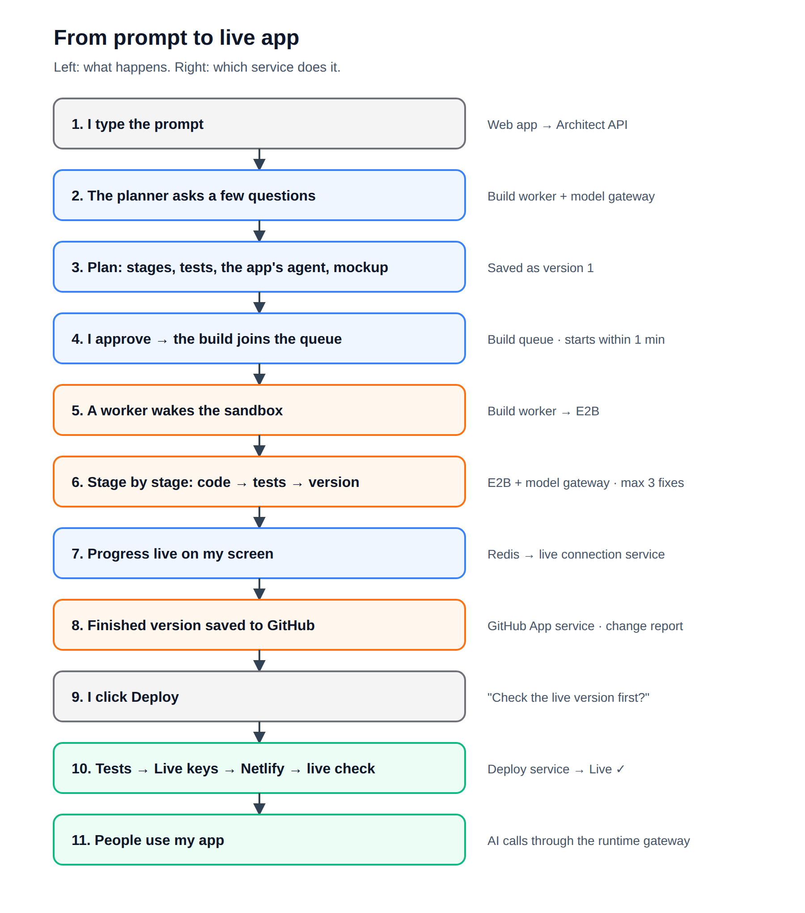

# Architect 2.0: architecture

**Isha Goyal** · Technical PM assignment, Lyzr

This file covers how architect.new works under the hood today, and how I'd build Architect 2.0 in the real world: sandboxes, the agent harness, switching models, how the screen talks to the backend and the preview, the proxy, GitHub, deploying (users' apps and Architect itself) and scaling.

How I researched it: I built an app on architect.new (a meal planner for Indian homes, "Didi, abhi kya banega?") and followed its network calls in the browser. The screens and product decisions are in `PRODUCT.md`.

Diagrams (also as separate image files):
- `architect-2.0-diagram.png`: every Architect 2.0 service and how they connect
- `architect-2.0-flow.png`: from prompt to live app
- `architect-today.png`: how architect.new works today

---

## Architect 2.0 at a glance

**How to read it:**
- **Top:** the people. Non-technical users and developers use the Architect web app. People using a finished app go straight to it on Netlify.
- **Middle:** Architect's backend on AWS.
- **Bottom:** outside services we rent or reuse.
- **Building:** a click goes to the Architect API → the build queue → the build workers (the agent harness).
- The workers run the code in an E2B sandbox and call AI through the AI gateway.
- Each finished version is saved to GitHub (as a pull request for developers).
- **Updates:** the workers post progress on a shared noticeboard (Redis) → the live connection service pushes it to the screen.
- **Going live:** the deploy service publishes the app on Netlify. When people use the app, its AI calls go through the runtime gateway.

## Services

| Service | What it does | Why I picked it | Covers |
|---|---|---|---|
| **Architect web app** (Next.js on Vercel) | Chat, plan, preview, versions, tests, cost. Code editor + terminal for developers | Already there. Vercel makes Next.js | Frontend, preview |
| **Login** (Memberstack, Clerk if enterprise) | Decides who you are | Memberstack already works. Clerk supports company login (Okta, Azure AD, Google Workspace), Memberstack doesn't | Login |
| **Architect API** (AWS) | Projects, plans, versions, tests. Starts builds and deploys | Already on AWS | Frontend ↔ backend |
| **Live connection service** (WebSocket) | Pushes progress to the screen | Replaces asking again and again (polling). Lyzr already uses WebSocket for metrics | Frontend ↔ backend, scaling |
| **Build queue** | A short line for builds and deploys in a rush | People wait a few seconds instead of getting errors | Scaling |
| **Build workers** (the agent harness) | Plan → stages → code → tests → version | Heavy work kept away from clicks. More workers are added when busy | Agent harness, scaling |
| **AI gateway** (model gateway + runtime gateway) | One door for every AI call, from the builder and from live apps. Counts usage | Built on Lyzr's model layer (providers, fallback, routing) | Models, proxy, scaling |
| **GitHub App service** | Connect, pull requests, bring in outside changes, import | The user picks repos, not all of them | GitHub |
| **Deploy service** | Build → tests → keys → database changes → Netlify → live check | One place for the whole deploy, and it can go back | Deploy |
| **Agent runtime** (phase 2, AWS) | Runs Python agents | Netlify functions don't run Python | Deploy (agents in any framework) |
| **MongoDB · Redis · S3** | Data, shared noticeboard, snapshots and old events | Already used today | Scaling |
| **Secrets store** (AWS Secrets Manager) | Keeps keys encrypted. The AI never sees them | Already on AWS | Proxy, deploy |
| **E2B sandboxes** + outgoing proxy | One private machine per project for building and preview | Already used. Pauses when idle | Sandboxes, proxy |
| **AI models** | Claude, GPT, Gemini, open-source (through Anthropic, OpenAI, Bedrock, Vertex…) | Lyzr already connects them | Models |
| **Lyzr Studio** | Agents, tools, data, voice, scheduler, workflows, traces | Reuse, don't rebuild | Agent harness, models |
| **GitHub** | Where the code lives | Where developers already work | GitHub |
| **Netlify** | Live apps + TypeScript agents | Already used | Deploy |

**Reuse Lyzr's engine, not its screens.** Lyzr Studio already has a lot that Architect doesn't show today:
- **12 model providers** (OpenAI, Anthropic, Gemini, Bedrock, Vertex, Groq, xAI…, incl. 2 for voice) + **fallback** + **routing** (LiteLLM Complexity Router)
- **62 tools** + MCP + custom tools (Architect's list showed 53)
- **23 data connectors** (vector stores and databases)
- A **scheduler** and a **workflow builder**, voice agents, telephony, memory, guardrails, traces, usage reports, simulation

Architect 2.0 uses these behind the scenes and shows everything about the app (agent runs, automations, errors, cost) inside Architect. Lyzr Studio is an optional link, never a step anyone needs.

---

# Part 1: How architect.new works today

## Diagram (today)

---

## 1. Frontend and backend

- **Frontend (web app):** `www.architect.new`
- **Backend:** `api.beta.architect.new`
- The frontend is built with **Next.js** and hosted on **Vercel**.
- It uses Next.js **App Router + server components**. Login also reaches the Next.js server through a **cookie**.
- Next.js **prefetches pages** → when I open a project, the dashboard is already loaded in the background, so going back is instant.

## 2. Tenants (brands)

- There are different tenants. The backend decides **which tenant / brand you are on**.
- By default, `architect.new` shows **Lyzr branding**.
- Another domain, e.g. `agents.somebank.com`, could show **their own branding**.
- The **first call** is the tenant config → it **doesn't need login** (no token is sent).
- The **list of backend service URLs** is saved in a cookie (`tenant_urls`) → most likely it comes from the tenant config.
- Services can be **switched on/off per tenant** → e.g. `maia` was `null` (off) for me.
- The API is **versioned** → Architect uses `/api/v1`, Lyzr agents use `/v3`.

## 3. Login

- Login is **outsourced to Memberstack**. Architect does not own its own login system.
- Lyzr **bought** auth instead of building it.
- The browser calls `client.memberstack.com/member`, and the frontend uses Memberstack's JS SDK (`@memberstack/client@1.2.0`).
- **Backend decides which tenant you are on; Memberstack decides who you are.**
- Memberstack likely also handles **plans** → plan IDs start with `pln_`.

## 4. Session

- The session is a **JWT sent as a Bearer token**.
- `iss`: issued by Memberstack
- `aud: app_cm3k…`: the Architect app inside Memberstack
- `id: mem_cmuf…`: me, the member

**How the token is used:**

Memberstack → gives a login token → the browser sends the token → Architect's API → (likely) verifies it with Memberstack's public key.

- My **Memberstack ID = my Architect user ID**.
- The login token lasts **14 days** → I stay logged in for 2 weeks.

## 5. Architect sits on top of Lyzr Agent Studio

- **Architect is the top layer.** Under it is **Lyzr Agent Studio**.
- All the heavy lifting (agents, RAG, voice, billing) runs on **Lyzr Studio's production backend**.
- **What Lyzr Studio has** (checked 29 Sep): **12 model providers** (incl. 2 for voice: Deepgram, ElevenLabs), LLM fallback, routing (LiteLLM Complexity Router), **62 tools** + MCP + custom tools, **23 data connectors**, voice agents, telephony, memory, guardrails, traces, usage reports, simulation.
- Architect shows **very little of this** today.

## 6–7. Microservices setup

Next.js on Vercel → **Architect API (beta)** → gives the list of Lyzr service URLs (tenant config) + handles projects, plan, sandbox, deploy

Browser → **Lyzr Studio microservices (prod)** directly → agent, RAG, crawler, voice, billing, metrics

- Architect's backend is **beta** (`api.beta.architect.new`); Lyzr's services are **production** (`agent-prod`, `rag-prod`, `pagos-prod`, `crawler-prod`).

Auth: Memberstack.

## 8. Data model

- `/apps/user/{me}/projects`
- **apps** = what the user builds (AI apps)
- **projects** = each thing you build is a "project"
- **Projects are tied to a user. Billing is tied to an org.**

## 9. Backend tech

- Likely **Python** backend with **MongoDB** → from the ID format and date format in the responses.

## 10. Code, sandbox and deploy

- Each **project** gets a **GitHub repo** inside the **Lyzr-Apps organisation**.
- The code runs in a **cloud sandbox**, a temporary cloud machine, for the live preview.
- When apps are deployed, they go live on **Netlify** under **architect.space**.
- If you connect GitHub, Architect stores the credentials **server-side**.

## 11. The AI works in stages

- `session_id`: my chat session with the builder
- `plan_phase: handed_off`: the plan was handed over
- **Planner → Coder**

## 12. The planner (how Architect thinks)

- The **whole planning chat is stored inside the project**: messages, plan, mockup and skill file all go into one `state` object.
- The planner writes in a **custom markup**, and the frontend turns it into UI (options, buttons).
- **Two ways to build:**
  - **Default Lyzr agents**
  - **GitAgent (beta)**: the agent lives in its own GitHub repo
- First, it asks me **multiple-choice questions**.
- Then it makes **3 things**:
  - a **PRD** (the plan)
  - an **HTML mockup** (how the app will look)
  - a **skill file** (rules for the app's agent)
- It changes the plan in **small edits**, not by rewriting all of it.
- It has **theme presets**, and once chosen, the design is **locked**.
- The PRD is saved in the app's repo → `plan-handoff/prd.md`. It can be downloaded from the project's **⋮ menu** ("Download PRD"), but **not as a PDF**.
- **No plan versions** → when the plan changes, the old one is overwritten.
- **The project's ⋮ menu** holds: Download Code, Environment variables (Beta), Duplicate App, Saved versions, View File Tree, Delete App, plus items that **change with the tab**: on Plan, Clear PRD and Download PRD; on Agents, "Feature testing: Off", Clear Chat and Clear Agents. I only found several of these late, because they're hidden there, and some delete things.
- **Saved versions** are bookmarks saved as git tags, and they **only work with a linked GitHub repo**. Without it, the only way back is "Revert to this version" in the chat.
- **Environment variables:** encrypted at rest, but Architect's own note says the **AI builder in the sandbox can read them**. There is **one set** of values: it applies to the preview right away and to the live app on the next deploy.
- **Share:** only with members of the same org. It shares agents, knowledge bases and resources. GitHub access is given separately, on GitHub.

## 13. Sandbox

- The sandbox company is **E2B**. My app runs inside it on port **3333**.
- The sandbox **times out ~10 minutes** after the last activity → every activity pushes the timer forward.
- A paused sandbox shows a **"Resume Sandbox"** button. I have to click it myself.
- Its status is kept in **Redis** (a fast cache), so the backend doesn't ask E2B every time.
- The health check looks at 3 things: the sandbox is running, the app process is alive, and the page replies with **200 OK**.
- The preview runs the app in **development mode** (hot reload), so code changes show up instantly.
- Hot reload uses **Webpack** → only the changed code is sent to the preview.
- The preview opens with its own **1-hour pass (token)** made by Architect.
## 14. How the builder works

**How a build flows:**

1. I send a message → the **planner agent** asks questions and writes/updates the plan (PRD, mockup, skill file). The plan is saved **inside the project record**.
2. When the plan is ready, it's **handed off** → the PRD is saved in the app's repo (`plan-handoff/prd.md`) and passed to the **coding agent**.
3. The coding agent starts a **new session** and works **step by step inside the sandbox (E2B)**: editing files, running commands. It's likely **Claude** (its usage data looks like Claude's).
4. It also creates the app's **Lyzr agent** and **Postgres database**.
5. Every step is recorded in an **event log** (~6,500 events for my app). The chat is a filtered view of it. Stopping a build cancels this stream ("stream task cancelled").
6. **Build checks** run: code complete → production build passed → preview healthy → ready.
7. The work is saved as a **commit** + a **zip snapshot in S3**. The screen checks progress by **polling**.
8. On **Deploy** → the code is pushed to **GitHub** → goes live on **Netlify**.

**What I observed:**

- Every message I send starts a **new session**.
- One short reply took **16 steps** behind the scenes and read about **125,000 tokens** of context.
- The screen shows only **"taking actions"** while it works.
- Under each chat reply, the platform shows "**X steps · Y tokens**" (e.g. 18 steps · 92 tokens). Architect's AI says this is **not the full usage**. Nothing is shown **while building**.
- The commit I saw was named **"Update generated app"**. I can **revert** to an older commit.
- After a build, there is **one automatic test pass** ("single guaranteed pass"). When it got cancelled, it was marked **not retryable**.
- A **"Test"** toggle is hidden in the 3-dots menu. It's **off** by default and says it adds **2–5 minutes**.
- **Preview errors are detected.** A pop-up "Error Detected in Preview" covers the app, shows the raw error ("Error in child app · Type: network_error · Cannot connect to backend (/api/scheduler?action=list&agentId=…)") and offers "Yes, Help Me Fix It". In my app, the failing call was the **scheduler** endpoint, which may be linked to my 9 PM / 3 PM suggestions never arriving (not confirmed).
- There are only **Plan** and **Build** modes. A simple question took **18 steps** and showed **"Build request failed"**.
- The code **can be seen** through ⋮ → **View File Tree** (and a "Code" button on the mockup), but it's hidden in a menu: I built a whole app without finding it. Architect's own AI said there's **no code editor**. Changes happen through chat or by downloading.
- When I stopped a build midway, the work done so far was **saved as a commit and marked ready**.
- When I asked for changes after the build, the **plan (PRD) was edited first**, then the code was rebuilt.

**My app's build timeline (UTC):**

Project created (12:06) → **agent created first** (12:27) → **database created** (12:29) → code ready (14:19)

- ~**2 hours 13 min** in total (including my planning time).
- A rebuild took ~**53 seconds** from code done → ready.

## 15. AI models

- The AI inside my app is a **Lyzr Studio agent** using **OpenAI gpt-5.4**, paid through Lyzr's own OpenAI account.
- The agent always replies in a **fixed JSON format** and remembers the last **10 messages**.
- The AI that writes the code is **likely Claude** (its usage data looks like Claude's).
- I **didn't see any option to choose a model**.
- The agent's settings live in **Lyzr Studio**, not in the app's code. When I changed the plan, the **agent stayed the same** (last updated 24 Sep).

**My app's agent ("Ghar Ka Meal Assistant"):**
- Temperature **0.3**, **no tools**, no examples, tagged `architect`.
- It is **set to always give 3 meals**, even when I only update inventory.
- The **skill file is not attached** to the agent.
- The app uses **Lyzr Scheduler** → meal suggestions at **9 PM** (next day's breakfast + lunch) and **3 PM** (dinner).
- **The schedule ran, but I never knew.** Lyzr Studio's traces show the agent ran on time twice a day from 24 Sept, with a 0% error rate, but the suggestions never reached me. Nothing shows the steps after the agent (saving, notifying), and **I could only check any of this by opening a second product**, Lyzr Studio. There, two credit totals didn't match (5.97 consumed vs 3.2 / 20 used).
- Architect's Agents tab shows a diagram (question → agent → answer) and an Edit Agent panel (name, description, role, goal, the raw instructions, model settings, MCP servers). The schedule isn't shown there.

## 16. How the screen talks to the backend

- The browser talks to **Architect's API** (projects, plan, sandbox, deploy) **and directly to Lyzr Studio** (billing, agents).
- It uses **two keys**: the **Memberstack token** (who I am) and a **Lyzr API key** (for agents).
- Build status is **checked again every few minutes** (polling). While deploying, the **whole project** is downloaded again each time.
- Opening a project made **~7 calls**, and one huge project response repeated the mockup **~5 times** and the plan **~7 times**.
- The builder chat loads **2 rounds of messages first**, then older ones as I scroll up.
- Behind the chat is an **event log**. My app had about **6,500 events**.
- Analytics tools track the app: Mixpanel, PostHog, Microsoft Clarity and Vercel Analytics.

## 17. GitHub

- Code is saved to **Lyzr's GitHub (Lyzr-Apps)** automatically.
- Connecting **my own GitHub is optional**, and it asks for access to **all my repos**.
- Code is **pushed to GitHub when I deploy**.

## 18. Deploy

- The **live link is reserved** when the project is created.
- Clicking Deploy starts it **in the background** and the screen checks until it's done.
- The deploy sends settings to the app, including **my Lyzr API key and my email** → so the live app's AI calls **likely run on my account** (not confirmed).
- My live app's page title was **"Next.js App"**, the default name.
- **Manage Deployment** screen: Edit URL, share buttons, custom domain, Redeploy, Undeploy, Edit App Info, and a form to **publish the app to a marketplace** (with an AI "Generate" button).
- I didn't see any **check** before it showed live, and there's **no "go back to previous version"**.
- The host (**Netlify**) is **chosen on each deploy** → I can deploy from the platform's repo or my own.
- The settings are sent in **3 name styles** → plain, Vite, Next.js (e.g. `LYZR_API_KEY`, `VITE_LYZR_API_KEY`, `NEXT_LYZR_API_KEY`).
- My app went live in **under ~20 minutes**.

## 19. Credits and plans

- **Billing is tied to an org.** An org was created for me automatically when I signed up.
- Free (Community) plan: **2,000 credits a month**.
- Paid plans have **top-up credits** and **seats** for teams.

**What I observed about credits** (these are readings, not confirmed rules; I'm not sure what each charge was for):

| When (IST) | Used credits (Lyzr) | What I had done before it |
|---|---|---|
| 27 Sep, ~21:00 | 1,248.67 | First build + first fixes |
| 28 Sep, 14:13 | 1,447.64 (+199) | Reported bugs, asked for the cleanup, rebuild. This charge landed ~9 sec after a build finished |
| 28 Sep, 15:00 | 1,481.16 (+33.5) | Deploy, a cancelled test pass, a revert, sandbox paused/resumed. **No build finished**, so I don't know what this was for |

- By 28 Sep I had used **~74% of the month's 2,000 credits in 4 days**.

**Three different cost numbers in three places:**

| Where | Number | Label |
|---|---|---|
| Lyzr billing (network call) | 1,481.16 used of 2,000 | Lyzr credits |
| Architect usage page (`/usage`) | 9.4613 | "one credit per billed USD" |
| Builder top bar | $5.19 | no label |

- I couldn't work out how these three relate.

**The usage page (`architect.new/usage`):**
- Total credits, a chart of usage over time (7 / 30 / 90 days, 12 months), and a breakdown **by app**.
- Tabs: **My Usage** and **All Users**.
- It says credits are "**dated by sandbox session rather than by individual call**" → all my usage showed on 28 Sep, even though I worked from 24–28 Sep.
- There's **no cost per action** and nothing shown **while building**.
- Projects also carry an **org ID**, so they belong to the org too.
- **Orgs can have sub-orgs** → e.g. a company → its departments.
- Colleagues could **join by company domain** (e.g. `@company.com`).
- **Roles** → I'm the **owner** of my org. Permissions are set **per API route**.
- **Onboarding check** → `/preferences/exists` decides whether to show onboarding or go straight to the dashboard.

## 20. The app it built for me

- A full **Next.js app**: screens + its own backend routes (`/api/...`).
- Its **own Postgres database**, with one table per feature (households, inventory, meals).
- Its **own login** (email + password), separate from my Architect login.
- The app's login lasts **7 days**.
- **One household per user** → household ID = my user ID.
- It has a **`/api/seed`** route (for sample data) → it was called right after I logged in.
- **Selecting** a meal → saves only the selection.
- **Confirming** a meal → **one call** (`/api/confirmed-meals`) → per the PRD it should save to history + reduce inventory. I couldn't check the result because the app broke.

## 21. Tools for agents

- Agents can use **53 ready-made tools** (Gmail, Slack, Notion, Salesforce…) from **Composio** and **ACI**.
- You can also add your own tools with **MCP servers**.
- There is **no WhatsApp** tool.

## 22. Where it runs

| Part | Where |
|---|---|
| Frontend | Vercel |
| Architect API | AWS, behind a load balancer |
| Sandbox status | Redis |
| Code snapshots | AWS S3 |
| Preview | E2B |
| Live apps | Netlify (architect.space) |
| Logos | CloudFront (AWS) |

---

## Full flow

1. I describe an app
2. A session starts
3. The planner agent writes a plan
4. The plan is handed off to a coding agent
5. The code goes into a GitHub repo (Lyzr-Apps)
6. It runs in a sandbox for live preview
7. Deploy
8. Netlify on architect.space
9. The generated app calls Lyzr Studio agents for its AI features

---

# Part 2: How I'd build Architect 2.0

Each topic compares today with 2.0 and gives the reason. The problems I hit and the screens are in `PRODUCT.md`; this part is only how the system works.

## 1. Sandboxes

**Today:**
- E2B, one sandbox per project, app on port 3333 in development mode.
- It pauses after ~10 minutes. I click "Resume Sandbox" myself.
- The health check looks at 3 things: the sandbox is running, the app process is alive, and the page replies with 200 OK. It doesn't check that the app's features work.
- There is a browser test, but it's hidden in the 3-dots menu, off by default, and adds 2–5 minutes.

**In 2.0:**
- **Stay on E2B.** AI-written code needs its own private machine. E2B already does this and pauses when idle. My problems came from how Architect uses it, not from E2B.
- **Tests after every build:**
  - Tests are written with the plan, before any code, in plain words ("Shows exactly 3 meals"). The user sees and can change them.
  - Each stage has its own checks. At the start of a stage, the AI turns them into small scripts; after the stage's code, the scripts run in the sandbox (under a minute, no AI).
  - Checks for later stages are "not run yet", not failed. Checks for a whole flow ("confirming a meal reduces the stock") run at the end, and the full list runs again before deploy.
  - AI is used only when a check fails, to fix the code (3 tries, then it asks). Changing a test is never silent: it shows in the change report and needs approval.
- **When a change goes wrong:**
  - With review on: every build happens on a copy (branch) with its own preview next to the main one. It's merged only when finished, tests pass and it's approved. Stop → "Continue later" or "Throw away".
  - By default: every change goes to the main copy and is saved as a version. One click goes back. Background checks warn: "This may have broken X. Undo?"
- **Wakes up on its own** when the project or preview is opened. No Resume button.
- **Cleans up:** the sandbox is deleted after 30 days unopened (free plan, longer on paid) and rebuilt from GitHub when reopened (~1–2 min). Nothing is lost: the code is in GitHub and the data is in the app's database.
- **Before deploy:** an optional private link to the real production version, to check it first.

**Why:**
- The check said my app was fine when it wasn't.
- Script tests are fast and cost no AI, so they can run every time.
- With review on, stopping a build never touches the main copy. By default, if something breaks, one click undoes it.
- Others do the same: MongoDB Atlas pauses free clusters after 30 days without activity (data kept). Render deletes free databases 30 days after creation (+14 days grace).

## 2. The agent harness

**Today:**
- Planner → coder handoff. Every message starts a new session.
- One short reply took 16 steps and read ~125,000 tokens of context.
- The screen said only "taking actions".
- No plan versions: the old plan is overwritten.
- Only Plan and Build modes. A simple question took 18 steps and showed "Build request failed".
- Code only viewable through a hidden menu (⋮ → View File Tree), no editor. Cost only as "X steps · Y tokens" under chat replies, nothing while building.

**In 2.0:**

**Planning**
- A new project goes Describe → Refine → Plan → Build. Refine and Plan run on a build worker through the model gateway. Nothing is built until the plan is approved.
- The plan holds: what the app does, the stages, the tests in plain words, the app's agent and a mockup. It's saved as a file in the repo (`plan.md`) and as version 1.
- Editing the plan by prompt shows what will change before anything is applied (Accept / Reject).

**Stages**
- The plan is split into small stages that can each be tested. Each stage is built → tested → saved as a version.
- By default the stages run on their own. With review on, each stage waits for approval. Stages are reordered or skipped by editing the plan, so the plan and the stages always match.

**Modes = what the agent is allowed to do**
- **Ask:** read-only tools. It can read the code and the plan, never write. Cheap, and it can't break anything.
- **Plan:** can change only the plan files.
- **Build:** full tools: write code, run commands in the sandbox, run tests.
- A change request in Ask mode suggests switching instead of failing. A big request in Build mode suggests planning first.

**Versions**
- A version = plan + code + agent together, named from the change.
- Going back restores all 3 (not the app's data) and is saved as a new version, so it can be undone too.
- Developers can go back one part only and see the exact differences.
- **Change report after every change:** what changed, which parts, checks before → after (a check that passed and now fails is the "may have broken X" warning), any test change to approve, and the cost.

**Where changes go** (the two views use one system)
- **Developer view** only changes what the screen shows. It never changes how a build runs.
- **Review changes** (a project setting) decides where a build's work goes:
  - Off: straight to the main copy, each change a version.
  - On: each person works on their own copy (branch). Copies meet only when approved; if two changed the same lines, the person approving chooses (see both, keep one, or let AI suggest a combined version).
- It switches only between stages. A stage is the smallest finished unit, so switching mid-stage would leave half on main and half on a copy.
- With review off and two people on a project, builds go one at a time.
- The editor is read-only while a stage runs. Pressing Stop leaves the stage marked **"Stopped · not tested"**, never "ready" (today a stopped build was marked ready and my app broke). Continuing picks up from the developer's edits and reruns the tests.
- Terminal commands that change the code (e.g. installing a package) are saved as versions.

**Recovering from errors**
- After 3 failed fixes on the same check, it stops and asks instead of spending more.
- If a worker crashes, another continues from the last finished stage, so the AI isn't paid for twice.
- The build keeps going if the tab is closed; a notification (browser, or email if chosen) says when it's ready.

**Cost tracking**
- Every AI call goes through the gateway, which records the tokens read and written. That gives the cost per step, per stage, per project, and split between building and the live apps' AI (including scheduled runs).
- One unit everywhere: % of the month's credits (today I saw different numbers in four places: Architect's usage page, the builder's top bar, Lyzr billing and Lyzr Studio's monitoring).
- **Before a build, a range per step, not a number:** the gateway's records of similar steps in past builds give "usually X–Y%". A single number would only be a guess, because the cost depends on how many fixes the AI needs.
- A forecast from the pace of use ("you may run out before your credits refresh"). With my credits (74% gone in 4 days), it would have warned me around day 2.
- "Where the credits went" is worked out from the same records, as causes (e.g. "3 fix attempts in stage 3").

**The app's own agents: agents as code**
- **Agents live in the repo**, for every framework. Lyzr agents use **GitAgent's format** (Lyzr's open-source format): `agent.yaml` for role, goal, model, tools and reply format; `.md` files for instructions; folders for skills, tools and memory. This also fixes today's unattached skill file.
- **Code is the single source of truth. Lyzr Studio shows the same files:** a code change → Studio shows "Agent updated. Refresh". "Save" in Studio → a pull request (reviewed with review on, merged behind the scenes by default).
- **Frameworks:** Lyzr (default) · Supported: LangGraph / LangChain, CrewAI, OpenAI Agents SDK, Vercel AI SDK · Works: anything else runs in the sandbox and is tested from outside.
- **Tools:** Lyzr Studio's catalog (62 tools + MCP + custom). Each agent gets only the actions it needs (e.g. read emails, not delete).
- **Automations** (scheduled or triggered runs) are built on Lyzr's Scheduler and workflow builder. **Every run records each step's result, not just the agent's** (agent ✓ · saved ✓ · notification ✗). Today my app's 9 PM / 3 PM runs happened with 0% errors, but the result never reached me, and nothing showed which step failed.
- **Existing Architect projects:** the agent is moved into GitAgent files the next time the project is opened, with agent tests before and after.
- **Finding agents in imported code, without guessing:**
  1. **Rules per framework:** a code reader looks for known patterns (CrewAI `Agent(role, goal…)`, OpenAI Agents SDK `Agent(name, instructions, model, tools)`, LangGraph, Vercel AI SDK `generateText({model, system, tools})`) and maps them to the same fields: name, instructions, model, tools, prompt files, keys.
  2. **Run once and watch:** the gateway sees the exact prompt, model and tools, and a text search finds the file they came from.
  3. **Confirm with evidence** in one click.
  4. **Instruction files** (`AGENTS.md`, `CLAUDE.md`, Cursor rules) tell other AI coding tools to keep this structure.
  5. **Unknown → read-only.** The agent still works, it just can't be edited in Architect.
  - Only prompts stored at a provider (e.g. OpenAI prompt IDs) or agents hosted on another platform need one step: "Bring it into Architect."

**Why:**
- I stopped my build because I couldn't see what it was doing.
- Stages give a safe place to stop, test and go back.
- Lovable, Replit, Cursor and Claude Code all have a spending limit. I didn't find one in Architect.
- My agent lived only in Lyzr Studio, so a developer couldn't edit it in the code, and changing the plan didn't change the agent.

## 3. Models

**Today:**
- The builder is likely Claude. No choice.
- My app's agent uses OpenAI gpt-5.4 through Lyzr's account. No choice.
- Lyzr Studio already has 12 providers, fallback and routing.

**In 2.0:**
- **One AI gateway**, built on Lyzr's model layer. Nothing talks to a provider directly, so switching a model is a setting.
- **Only suitable models are shown.** A list says what each model can do (read images? use tools? long text?).
- **Backup order** if a provider is down. A build switches only between stages, never in the middle of one.
- **A model is offered only after it passes our tests** on real build tasks.
- **Builder model:**
  - Non-technical: Auto + Standard / Max (like Bolt and Replit).
  - Developer: Auto, or pick the exact model (like Cursor, Replit paid plans, Emergent).
  - Whatever is picked shows a short note on what drives usage.
- **Model inside the user's app:**
  - Non-technical: Auto + "Faster & cheaper / Best quality". Tests run before switching: "Not switched, it broke meal suggestions."
  - Developer: provider + exact model per agent, settings, backup order, cost per 1,000 uses, agent tests before switching.
  - Who pays: Architect's AI on credits (default), or the user's own key. Lyzr Studio already supports own keys.

**How others do it (from their docs):**

| Product | Model choice |
|---|---|
| Lovable | None |
| Bolt | Standard / Max |
| Replit | Auto on free, Auto or pick on paid |
| Emergent | Dropdown |
| Cursor | Pick or Auto |
| Claude Code | `/model`, within Claude |
| Architect today | None |

**Why:**
- Non-technical builders (Lovable) hide the model choice. Developer tools (Cursor, Claude Code) show it. Architect has both users, so it needs both.
- Testing before offering a model means a new model can't quietly break builds.

## 4. Frontend ↔ sandbox ↔ backend, and the live preview

**Today:**
- Actions (save, deploy) are normal requests. That's fine.
- Progress is checked by asking again and again (polling). While deploying, the whole project was downloaded again each time.
- Opening a project made ~7 calls and one huge response (the mockup ~5 times, the plan ~7 times).
- The preview is a frame loading E2B's address with a 1-hour pass. Hot reload shows code changes instantly.

**In 2.0, three connections:**

| Connection | Used for | Goes to |
|---|---|---|
| Normal requests | Save, settings, Build, Deploy | Architect API |
| Live connection (WebSocket) | Stage progress, tests, cost, logs, Stop | Live connection service |
| Preview frame | The running app | E2B's address, handed out by the API |

- **Opening a project:** one small summary call (name, status, stage, sandbox, cost so far). The plan, mockup and chat load when their tab is opened.
- **Updates:** worker → Redis noticeboard → live connection service → screen. If the connection drops, it reconnects and catches up from the event log.
- **Preview:** keep E2B's address, pass and hot reload. With review on, "See before" needs two previews (before / after) = two sandbox links.
- **Each step's result is pushed the same way** (sample rows once the database exists, a test answer from the app's AI, the screen being written), so the preview shows progress instead of a spinner.
- **If a company network blocks live connections,** it falls back to asking every few seconds.

**Why:**
- With polling, the load grows with how many people have Architect open. With a live connection, it grows only with real activity.
- The screen shows every step, not just "taking actions".

## 5. Where the proxy sits

**Today:**
- The preview goes through E2B's own gate (`3333-<id>.e2b.app`). So a proxy already exists.
- The API sits behind an AWS load balancer.
- The deploy put my Lyzr key into the live app.
- Architect's own environment-variables screen says the AI builder in the sandbox can read the values, and one set of values is used for both preview and live.

**In 2.0:**
- **Preview:** keep E2B's gate. I'd build our own only if we change sandbox provider or want branded share links.
- **The proxies I add are at the AI layer:**
  - **Model gateway:** between the build workers and the AI models.
  - **Runtime gateway:** between live apps and the AI.
    - The live app no longer holds the creator's key. It sends its app ID + the end user's ID.
    - The gateway adds the key on the server, counts usage per app and per end user, and applies a monthly budget per app and a limit per end user (e.g. 20 meal suggestions a day).
    - Later, creators can charge their own users.
  - Same gateway, two callers.
- **Outgoing proxy:** the sandbox can only connect to the sites the app needs (package sites, Lyzr AI, connected tools). Everything else is blocked and logged.

**Keys and secrets (how the outgoing proxy keeps them from the AI):**
- Keys go in a separate Keys & passwords form, never in chat. If someone pastes a key in chat, it's caught and moved there.
- **Write-only:** once saved, nobody can see it again on screen, and the AI never gets it. Only the outgoing proxy and the host use it, on the server.
- **The AI never sees the values:**
  - The sandbox holds only placeholders. The outgoing proxy adds the real key on the way out.
  - An output filter hides any value that shows up in logs or replies.
  - Tests try to pull keys out, to check nothing leaks.
- Encrypted (AWS Secrets Manager). Never in code, GitHub or logs. Server side only.
- **Preview keys and Live keys** are kept separate.
- **A key found in imported code** (e.g. in `.env`): moving it isn't enough, because it stays in the repo's GitHub history. So the user is asked to replace it with a new key from the provider. Architect removes the key from the code and adds `.env` to `.gitignore` (git's list of files never to upload). It can't delete the old key at the provider, so it reminds the user.

**Why:**
- Don't build a preview proxy we don't need.
- Without the runtime gateway, anyone using my app spends my credits with no limit.
- Today the AI can read the keys, by Architect's own note.

## 6. GitHub

**Today:**
- Code goes to Lyzr's GitHub (Lyzr-Apps) automatically and is pushed when I deploy.
- My own GitHub is optional and asks for access to all my repos.
- Saved versions are bookmarks (git tags) and only work with a linked GitHub repo.
- No sign of outside edits coming back. No import. Versions are called "Update generated app".

**In 2.0:**
1. **Connect with a GitHub App:** the user picks which repos.
2. **Where code lives:**
   - By default: Architect's GitHub in the background, no GitHub account needed. "Move to my GitHub" any time, with full history (free, so the code is never locked in).
   - Developers: their own repo from the start (two-way sync is part of the Developer add-on; on the free plan, Architect works on a copy).
3. **Every finished version** (tested, named) is saved to GitHub with its change report. Versions don't need the user's GitHub.
4. **With review on:** each change arrives as a **pull request**, and the main branch is locked with GitHub's branch protection. Only approvers merge. Everyone, including the AI, goes through a pull request.
5. **Outside edits come in only when the developer asks, never automatically.**
   - GitHub tells the GitHub App service about new changes; the developer is notified and a "Get latest" action becomes available. Before a build or a pull request, Architect reminds them if their copy is behind.
   - On "Get latest": changes in different places are combined by git. Changes to the same lines go to the developer: keep GitHub's, keep Architect's, or let AI suggest a combined version (shown as a change to approve, never applied on its own).
   - Only for developer repos: code in Architect's GitHub isn't edited by anyone else.
6. **Merge to main → deploys automatically.**

**Import an existing project:**
1. Pick a repo → it runs in a sandbox. The framework is detected and packages installed. (Free plan: Architect works on a copy in its own GitHub; the user's repo isn't touched.)
2. **Keys are asked for** (see the proxy section).
3. The AI writes a plan from the code ("here's what I think your app does"). **The plan must be confirmed before building**, because every build and every check depends on it. Until then only Ask mode works.
4. Tests show what works before anything is changed.
5. Keep building in Architect.
- **The tech is not changed.** A Next.js app stays Next.js.
- **Existing agents are found and managed inside Architect** (see the agent harness).

**Why:**
- Developers and companies won't connect a tool that wants all their private repos. Vercel and Netlify also let you pick repos.
- Developers live in GitHub: reviews, other tools, their own history.

## 7. Deploy

### A user's app

**Today:**
- Netlify on architect.space. The live link is reserved when the project is created.
- The Manage Deployment screen has Edit URL, share buttons, custom domain, Redeploy, Undeploy, Edit App Info and a marketplace form.
- My live app's title was "Next.js App".
- I didn't see any check before it showed live. There's no "go back".

**In 2.0:**
- **Keep Netlify** and what the Manage Deployment screen does today.
- **App info comes from the plan:** title, description and share preview, for the app and the marketplace.
- **"Live ✓" only after a quick check** on the live link.
- **If the live check fails, the previous version stays live automatically.** People using the app never see a broken version.
- **One click: "Go back to previous version".**
- **Live keys are set on the host**, and the app's AI goes through the runtime gateway, not the creator's key.

**Under the hood:**

Tested version from GitHub → production build → tests → Live keys set on the host → database changes if needed → upload to Netlify → address + HTTPS → live check → **Live ✓** (or the previous version stays) → every deploy kept, so going back = pointing the address back. Each step is pushed to the screen through the live connection.

- By default: one button, with progress.
- Developers: also deploys on merge to main and sees each step.

### Where the app's agents run

Automatic by default:
- **Phase 1:** Lyzr agents on Lyzr + TypeScript agents on Netlify functions (already there).
- **Phase 2:** Python agents (LangGraph, CrewAI) on a new agent runtime on AWS. Netlify functions run TypeScript, JavaScript and Go, not Python.
- Any time: the developer's own cloud, if they want.

The new runtime needs: packing and running an agent automatically, one standard way to call any agent, and plugging into the gateway, traces, scheduler and secrets.

**Why developers would use this:** they write the agent logic, and Architect runs everything around it (hosting, models, tools, scheduler, tests, traces, cost per user, deploy and rollback). It's still their code, in their GitHub.

### Architect 2.0 itself

**Stays on AWS.** It's already there: the AWS load balancer cookie (`AWSALBTG`), the S3 snapshot key and CloudFront logos. Moving clouds would take months and give users nothing.

- **Keep:** website on Vercel, API on AWS + MongoDB, Redis, S3, E2B, Netlify, Lyzr Studio.
- **Add:** build workers, live connection service, AI gateway, outgoing proxy, secrets store, GitHub App service, agent runtime (phase 2).

**Steps to put it on AWS:**
1. A private network (VPC).
2. Each service packed as a container (Docker).
3. Run them on ECS. It restarts crashed containers and adds or removes copies based on load.
4. Data: MongoDB, Redis, S3, Secrets Manager.
5. Load balancer + domain (Route 53) + HTTPS. It also carries the live connections.
6. Point the Vercel website at the API.
7. Connect E2B, Netlify, Lyzr, the AI providers and the GitHub App.
8. Releases through GitHub Actions + Terraform: **dev → staging → production** (today the API is still "beta").
9. Monitoring (CloudWatch, Sentry), backups, and one-step release rollback.

**Login:** if Architect 2.0 goes after enterprise customers → move to **Clerk** (company login through Okta, Azure AD, Google Workspace). If not, stay on Memberstack. Teams stay in Lyzr's existing orgs.

## 8. Scaling to thousands of users

Machines cost a fixed amount per minute. AI cost grows with every step, every retry and a bigger model. So the limits go on AI.

| What | Cost |
|---|---|
| E2B sandbox (~$0.17/hour) | ~3 cents for 10 minutes |
| AWS build worker (~$0.05/hour) | under 1 cent for 10 minutes |
| AI | Not fixed. It grows with every step, retry and bigger model. One short reply in my build read ~125,000 tokens |

**Many builds at once:**
- Builds run on separate build workers, not on the servers handling clicks.
- In a rush, builds wait in a short line instead of showing errors.
- More workers are added when anyone has waited more than ~20 seconds, and removed when it's quiet. A few spares are always on (~$360/month for 10 small ones).
- **Target: every build starts within 1 minute.** If a rush goes over that: "We'll notify you when it starts."

**Sandboxes:**
- Only people building need sandboxes. People using live apps are on Netlify.
- Pause after ~10 min idle, wake on open, delete after 30 days unopened.
- E2B caps how many run at once: Pro 100 ($150/month), add-ons to 600 or 1,100, Enterprise tens of thousands. Buy the tier for our busiest hour, with an alert at 80%.

**AI cost and rate limits:**
- The AI remembers nothing between steps, so it re-reads everything each time. Reading is most of the cost.
- **Measure first, then tune.** I saw ~125,000 tokens read in one reply, but I can't see from outside how much was already reused. So first measure cost per build, retries, and how much is reused. Then:
  - Send only what each step needs.
  - Reuse recently read text (10% of the price).
  - Use small models for small jobs (Haiku $1 vs Opus $4 per million).
  - Stop after 3 failed fixes.
  - Run non-urgent work (nightly tests) at 50% off.
- Rate limits: the same model through more than one route (Anthropic, Bedrock, Vertex). Lyzr already has Bedrock and Vertex.

**Thousands of open screens:**
- An open screen is a quiet connection. One small server holds thousands.
- 10,000 screens ≈ 2–3 small servers ≈ $100/month.
- Any server can serve any user, because everything lives in MongoDB and Redis.

**Limits per plan:**

| | Free | Pro | Team / Enterprise |
|---|---|---|---|
| Builds at the same time | 1 | 3 | More |
| In a rush | Waits + upgrade note | Skips the line | Own reserved workers |
| AI usage per month | Small | Bigger | Per team |
| Sandbox size | Standard | Bigger | Bigger |

- The first build is always fast, for everyone.
- When a limit is hit, the current stage finishes first, so the app never breaks. The app stays live; its AI features pause until credits are added or the month resets (Lovable's docs describe the same).

**What I'd measure:** time to start a build, failed or restarted builds, cost per build, how much text is reused, and "too many requests" errors.

---

## From prompt to live app: the walkthrough

**My prompt:** *"Build an app that suggests 3 Indian meals from what's in my fridge, and lets me confirm one."*

1. **I type the prompt.** The web app sends it to the Architect API. A project is created, and its live link is reserved.
2. **Refine.** The planner shows what it understood from my prompt and asks only what's missing (veg or non-veg? how many people?). This runs on a build worker, through the model gateway.
3. **It shows the plan:** what the app does, the stages, the tests in plain words, the app's agent ("suggests 3 meals from your fridge, can't change your inventory") and a mockup. The plan is saved as version 1.
4. **I approve.** The API puts the build in the queue. Normally it starts right away. In a rush, within a minute.
5. **A build worker picks it up** and wakes the project's E2B sandbox.
6. **Stage by stage** (database → login → inventory → meal agent → screens), for each stage:
   - The worker asks the AI (model gateway) to write the code, sending only the files that stage needs.
   - The code runs in the sandbox. Packages come through the outgoing proxy.
   - The script tests run in under a minute. If one fails, the AI fixes it (3 tries at most, then it asks me).
   - The stage is saved as a version: plan + code + agent. The agent is written as GitAgent files.
7. **I watch it live.** Each step goes worker → Redis → live connection service → my screen: "Building step 3 of 5: meal suggestions · Used 3% of this month's credits so far", then "Step 3 done ✓ All 3 checks passed." The preview updates with hot reload.
   - With review on, I'd approve each stage and could edit code in between.
8. **The finished version goes to GitHub** with a change report (Architect's repo for me, or a pull request to my own repo as a developer).
9. **I click Deploy.** It asks: "Want to check the live version first?"
10. **The deploy service** runs the full tests → sets the Live keys on Netlify → updates the database → publishes → checks the live link → **Live ✓**. The title and share preview come from the plan, not "Next.js App".
11. **People use my app.** Its meal agent calls AI through the runtime gateway, with my app's monthly budget and a limit per user. My own key is never in the app.

**If I press Stop at any point:**
- With review on: the work is on a copy, so the main app stays as it was.
- By default: the change is saved as a version marked "Stopped · not tested", and one click goes back.

---

## Things I couldn't confirm

- How much of the ~125,000 tokens was already reused from cache, and the real AI cost of a full build. I'd measure that before tuning anything.
- Whether E2B charges for storing paused sandboxes. Cleaning up after 30 days keeps it small either way.
- How many live connections one server really holds. I assumed 5,000 and would confirm with a load test.
- The sandbox and worker costs come from public prices, not Architect's real bill.

## My key decisions

| Area | Decision | Main reason |
|---|---|---|
| Platform | Reuse Lyzr's engine (models, tools, scheduler, workflows, traces), show everything in Architect | It already exists; one place for the user |
| Sandboxes | Stay on E2B, tests written with the plan and run after every stage, wake on open | The check said my broken app was fine |
| Harness | Stages, modes as tool permissions (Ask / Plan / Build), versions (plan + code + agent), change report, stop after 3 fixes | See what it's doing, go back safely |
| Changes | Review off: main + version. Review on: own copy per person, merged on approval, switched only between stages | Stopping a build broke my app |
| Cost | Gateway records every call; one unit (% of the month); a range per step before building; forecast; building vs live apps | Four places showed four different numbers |
| Models | One AI gateway on Lyzr's model layer, tested models, Auto or pick | Switch models without breaking builds |
| Screen ↔ backend | Live connection instead of polling, each step's result pushed | See every step, less load |
| Proxy | Keep E2B's gate, add model + runtime gateways and an outgoing proxy | Live apps stop spending the creator's credits |
| Secrets | Write-only, placeholders in the sandbox, preview and live keys separate | Today the AI can read the keys |
| GitHub | GitHub App, pull requests, locked main, outside changes only on request, import with a confirmed plan | Pick repos, review changes |
| Agents | Agents as code (GitAgent format), any framework, automations record every step | Developers edit agents in code; my scheduled runs failed silently |
| Deploy | Netlify, Live ✓ after a check, previous version stays live if it fails, one-click back | Don't say live until it works |
| Architect itself | Stay on AWS, dev → staging → production | Already there |
| Scaling | Queue + workers, start in under 1 minute, limits per plan | AI cost grows with use, so limits go there |

## Sources

- [E2B pricing](https://e2b.dev/pricing) · [E2B docs](https://docs.e2b.dev/)
- [Claude pricing](https://platform.claude.com/docs/en/about-claude/pricing)
- [AWS Fargate pricing](https://aws.amazon.com/fargate/pricing/)
- [AWS load balancer cookies (AWSALBTG)](https://docs.aws.amazon.com/elasticloadbalancing/latest/application/rule-action-types.html)
- [Netlify Functions: languages](https://docs.netlify.com/build/functions/get-started/)
- [MongoDB Atlas: paused free clusters](https://www.mongodb.com/docs/atlas/pause-terminate-cluster/) · [Render: free instances](https://render.com/docs/free)
- [Lovable credits](https://docs.lovable.dev/introduction/credits-and-usage) · [Replit AI billing](https://docs.replit.com/billing/ai-billing) · [Cursor usage limits](https://cursor.com/help/models-and-usage/usage-limits) · [Claude Code costs](https://code.claude.com/docs/en/costs)
- [Lyzr Scheduler](https://docs.lyzr.ai/agent-lab/agent%20features/schedulers) · [Lyzr Workflow](https://docs.lyzr.ai/agent-lab/orchestration/workflow/intro) · [Lyzr: Workflow vs Manager Agent](https://docs.lyzr.ai/agent-lab/orchestration/orchestration-engine/comparison)
